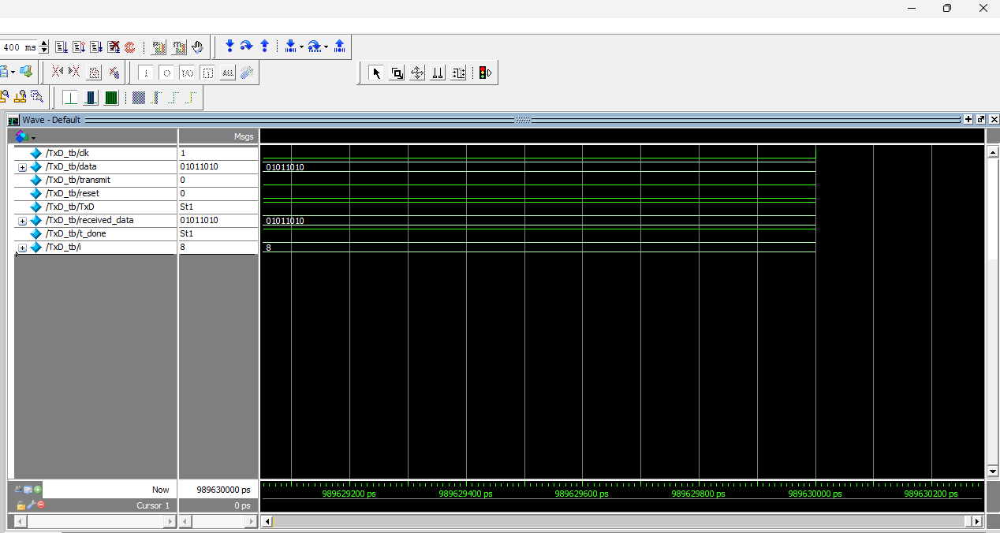

# UART (Universal Asynchronous Receiver/Transmitter)

## Introduction

UART, or Universal Asynchronous Receiver/Transmitter, is a hardware communication protocol that facilitates asynchronous serial communication between devices. It is widely used in embedded systems for communication between microcontrollers and peripherals such as sensors, displays, and other modules.

---------------------------------------------------------------------------------------------
## What It Does

UART allows for the transmission and reception of data over a serial communication channel without the need for a shared clock signal. It uses a pair of wires, one for transmitting (TX) and one for receiving (RX), to send data between devices. The communication is asynchronous, meaning that the devices do not need to be synchronized by a common clock signal. Instead, they agree on a baud rate, which is the speed at which data is transmitted.

---------------------------------------------------------------------------------------------
## Implementation

In this project, we are going to implement a UART receiver module in Verilog. This module will handle the transmission and reception of data, including the necessary start, & stop bits to ensure reliable communication. The implementation will be designed to be configurable, allowing for different baud rates and data formats.

---------------------------------------------------------------------------------------------

# Receiver Module
### Functionality

The UART receiver module is responsible for receiving serial data and converting it into parallel data. It typically performs the following functions:

1.  **Start Bit Detection:** Detects the start bit, which indicates the beginning of a new data frame.
2.  **Data Sampling:** Samples the incoming data bits at the appropriate time intervals based on the configured baud rate.
3.  **Data Storage:** Stores the received data bits in a register.
4.  **Stop Bit Verification:** Checks for the stop bit to ensure the integrity of the received data.
5.  **Error Checking:** Performs error checking, such as parity checks, to detect transmission errors (Optional).
6.  **Data Output:** Outputs the received data as a parallel byte.

### 8-Bit Receiver Implementation

Our UART receiver module will be designed to receive 8-bit data with one start bit and one stop bit. The steps involved in receiving data are as follows:

1.  **Idle State:** The RX line is normally in a high state.
2.  **Start Bit:** When the start bit (logic low) is detected, the receiver starts sampling the incoming data at the configured baud rate.
3.  **Data Bits:** The receiver samples 8 data bits.
4.  **Stop Bit:** After receiving the data bits, the receiver expects a stop bit (logic high).
5.  **Data Ready:** If the stop bit is detected, the received data is considered valid and is made available for further processing.

### Verilog Code Snippet (Conceptual)

Below is a conceptual Verilog code snippet illustrating the key components of the UART receiver module:

```verilog

module receiver_RxD (
    input clk, // 50 MHz clock
    input reset, // Key 0
    input RxD, // input signal - that sends the data
    output  [7:0] RxData // data that is received, LED's to test it
    );
endmodule
```
### Module Block Diagram


<u>**NOTE:** </u> 

- `The baud rate for the module is 9600 bits/sec`
- `The sampling rate is 4`
- `The module performs a mid-bit check to verify that the incoming signal is a valid bit & not a noisy interference`

-------------------------------------------------------------------------------------------------------------------------------------

## Input Signals Table

| Signal    | Description                                      |
| --------- | ------------------------------------------------ |
| `clk`     | 50 MHz clock input                               |
| `reset`   | Reset signal (Key 0 - subject to change)         |
| `RxD`     | Serial data input                                |
| `RxData`  | Received parallel data output (8 bits)           |

-------------------------------------------------------------------------------------------------------------------------------------
## Test and Simulation Results


# Transmitter Module
### Functionality

The UART transmitter module is responsible for transmitting parallel data as serial data. It typically performs the following functions:

1.  **Start Bit Generation:** Generates the start bit to indicate the beginning of a new data frame.
2.  **Data Loading:** Loads the parallel data into a shift register.
3.  **Data Transmission:** Transmits the data bits serially at the configured baud rate.
4.  **Stop Bit Generation:** Generates the stop bit to indicate the end of the data frame.
5.  **Error Handling:** Handles error conditions, such as when the transmitter is busy.

### 8-Bit Transmitter Implementation

Our UART transmitter module will be designed to transmit 8-bit data with one start bit and one stop bit. The steps involved in transmitting data are as follows:

1.  **Idle State:** The TX line is normally in a high state.
2.  **Start Bit:** When the module receives data, it sends a start bit (logic low).
3.  **Data Bits:** The module transmits 8 data bits.
4.  **Stop Bit:** After transmitting the data bits, the module transmits a stop bit (logic high).
5.  **Transmission Complete:** After the stop bit is transmitted, the data is considered sent.

### Verilog Code Snippet (Conceptual)

Below is a conceptual Verilog code snippet illustrating the key components of the UART transmitter module:

```verilog
module TxD (
    input clk,
    input [7:0] data,
    input transmit,
    input reset,
    output reg TxD,
    output reg transmission_done // flag that is raised when transmission is done
);
```


<u>**NOTE:** </u>

-   `The baud rate for the module is 9600 bits/sec`


-------------------------------------------------------------------------------------------------------------------------------------

## Input/Output Signals Table

| Signal             | Direction | Description                                      |
| ------------------ | --------- | ------------------------------------------------ |
| `clk`              | Input     | Clock signal                                     |
| `data`             | Input     | 8-bit data to be transmitted                     |
| `transmit`         | Input     | Enable transmission                              |
| `reset`            | Input     | Reset signal                                     |
| `TxD`              | Output    | Serial data output                               |
| `transmission_done`| Output    | Flag indicating transmission completion          |

-------------------------------------------------------------------------------------------------------------------------------------

## Test and Simulation Results




